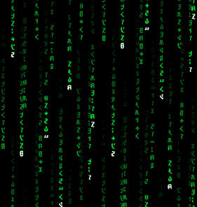

<!-- عداد الزوار بتصميم كبسولة احترافي -->

  

<!-- الهيدر الرئيسي مع تأثيرات بصرية -->

  
  <h3>🚀 Data Analyst | Programming Instructor</h3>
  
<i>Turning complex data into actionable insights & mentoring the next generation of developers.</i>

 

<!-- قسم التعريف الشخصي بنظام البطاقة مع أنيميشن -->
<table style="border:none;">
  <tr>
    <td width="60%" valign="top">
       <b>About Me</b>
        
      <ul>
        <li style="margin:15px 0;">🔭 <b>Programming Instructor</b> at <b>E-Youth</b> for the <b>DECI initiative (MCIT)</b>.</li>
        
        <li style="margin:15px 0;">💡 <b>Empowering students</b> to master programming through hands-on mentoring.</li>
        
        <li style="margin:15px 0;">🎓 Graduate of <b>Computers Science and Artificial Intelligence</b>.</li>
        
        <li style="margin:15px 0;">🌐 Specializing in <b>Web Development</b> (React, Node.js) & <b>WordPress</b> customization.</li>
        
        <li style="margin:15px 0;">📊 Expert in <b>Data Analysis</b> using SQL, Power BI, and Python.</li>
      </ul>
    </td>
    <td width="40%" align="center">
      
    </td>
  </tr>
</table>

 

<!-- قسم المهارات المحدث ليشمل الأدوات الجديدة -->

  <h2> 🛠️ Tech Stack & Tools </h2>

  <!-- Data Analysis Stack -->
  
<b>📊 Data Analysis & BI:</b>

  

    
    
    
    
    
  

  <!-- Backend & API Stack -->
  
<b>⚙️ Backend & Database:</b>

  

    
    
    
  

  <!-- Web Development Stack -->
  
<b>💻 Frontend Development:</b>

  

    
    
    
    
    
  

  <!-- CMS & Design Stack -->
  
<b>🔌 CMS & Page Builders:</b>

  

    
    
  

 

  <h2> 📈 Activity & Stats </h2>
  <!-- تم تحديث اسم المستخدم إلى Marefaay لضمان عمل الصور -->
  
  

 
<!-- قسم نشاط GitHub الأخير -->

  <h2> ⚡ Recent GitHub Activity </h2>
  

 
<!-- قسم التواصل -->

  <h2>📫 Let's Connect</h2>
  
  

 

  

  <code style="color: #2196F3; font-family: monospace; font-size: 1.8em;">
    Thanks for Visiting
  </code>

 

<i>"Building the future, one line of code at a time."</i>

